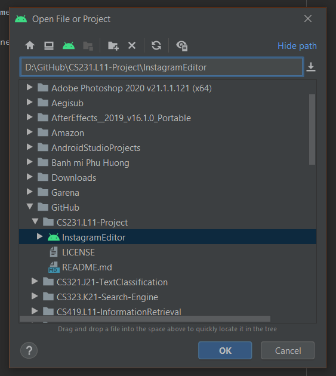

# CS231.L11 - COMPUTER VISION

***Vietnam National University HCMC, University of Information and Technology (UIT-HCM)***

**Class:** Computer Vision

**Class ID:** CS231.L11

**Project:** Instagram Editor

**Lecturer:** MSc. Vinh-Tiep NGUYEN - Nguyễn Vinh Tiệp

**Members:**

|Student's ID|Fullname|
|--|--|
|16521206|Phạm Ngọc Phúc Thuần
|16521540|Lê Ngọc Tuyết Trinh

---
## Offical apk:

1. Click [here](https://github.com/thuanpham1206/CS231.L11-Project/blob/main/InstagramEditor/offical%20apk) to download the apk.
2. Install the ***Instagram Editor***.

## Tutorial of repository:

1. Download (and install):

   - [Android Studio](https://developer.android.com/studio?gclid=Cj0KCQiA6Or_BRC_ARIsAPzuer9JwXQX5P4ElhW_GObRQrRWMdK3OmIo5B3kqv9hiONQ9dMOWaPrKpEaAmvaEALw_wcB&gclsrc=aw.ds)
   - [opencv-4.5.0-android-sdk.zip](https://github.com/opencv/opencv/archive/4.5.0.zip)

2. Steps to open:

    - Clone this repository.
    - Extract [opencv-4.5.0-android-sdk.zip](https://github.com/opencv/opencv/archive/4.5.0.zip) to C Disk.
    - Open Android Studio.
    - Click on "File" -> "Open..."
    - Open InstagramEditor in folder of cloned repository.
    
    - Click on "File" -> "Sync Project with Gradle Files"
